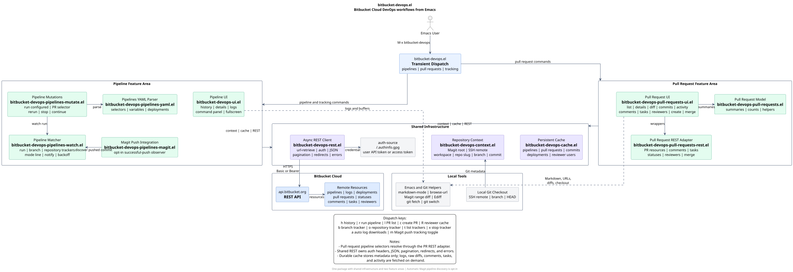

# bitbucket-devops.el

`bitbucket-devops.el` is one Emacs package for the Bitbucket Cloud workflows a
DevOps engineer commonly uses: Pipelines and pull requests. The Pipelines
features provide repository-aware history, details, completed step logs,
watcher notifications, manual triggers, manual-step continuation, reruns, and
cancellation. The pull request features provide newest-first listing and filtering,
persistent metadata caching, build summaries, details, comments/activity,
commits, changed-file summaries, raw diff buffers, current-user review actions,
reviewer management, top-level and inline comments, replies, creation, and
decline. See `bitbucket-devops-specification.md` for the package contract.

The package targets Bitbucket Cloud only. Bitbucket Data Center is not
supported.

## README.md is too long?

This package was made 100% with [OpenAI Codex](https://openai.com/codex/).
If this README starts looking like a small novel, you have options:

- Ask the
  [Bitbucket DevOps for Emacs Helper](https://chatgpt.com/g/g-6a3ffd3d8bcc8191bb75c20f0121dee0-bitbucket-devops-for-emacs-helper)
  custom GPT.
- Watch the demo video to see the package in use. The video is a usage
  walkthrough, not a setup guide.

  [](https://youtu.be/jSwK5WlVZrg)

## Requirements

- Emacs 29.1 or newer
- Magit 4.0.0 or newer
- `markdown-mode` 2.6 or newer
- `transient` 0.3.0 or newer
- `yaml` 1.2.3 or newer from GNU ELPA
- A Bitbucket Cloud repository with Pipelines enabled
- An SSH Git remote in one of these forms:

  ```text
  git@bitbucket.org:workspace/repository.git
  ssh://git@bitbucket.org/workspace/repository.git
  ```

The default remote is `origin`. Set `bitbucket-devops-remote` to use another
remote. Use `bitbucket-devops-repository-overrides` when a repository needs
an explicit workspace and slug.

## Authentication

Store a scoped Bitbucket Cloud token in `.authinfo.gpg`. App Passwords are not
supported. Every credential is selected through `bitbucket-devops-auth-rules`.
Each rule points to an auth-source host alias; API requests still go to
`api.bitbucket.org`.

For a repository, project, or workspace access token:

```text
machine bitbucket-devops-williseed1-test login x-token-auth password ACCESS_TOKEN
```

Grant Pipelines `Read` permission for history and logs. Grant Repositories
`Read` permission for commit messages and authors. Grant Pull Requests `Read`
permission for pull request list and detail buffers. Grant Pull Requests
`Write` permission for approvals, change requests, comment management,
creation, merge, and decline. Grant Pipelines `Write` permission to trigger
and stop runs.

Bitbucket automatically selects and locks Repositories `Read` when Pull
Requests `Read` is selected, and Repositories `Write` when Pull Requests
`Write` is selected. Repository, project, and workspace access tokens use a
coarse-grained `pullrequest:write` scope model, where pull request write access implies
`repository:write` to support merging. This inherited permission cannot be
removed while retaining Pull Requests `Write`, even though this package does
not push code or call repository-write APIs. Removing only the package's merge
command would not change the permission that Bitbucket grants for this scope.

For an Atlassian user API token:

```text
machine bitbucket-devops-williseed1-test login user@example.com password API_TOKEN
```

Grant `read:pipeline:bitbucket` for history and logs. Add
`read:repository:bitbucket` for commit messages and authors. Add
`read:pullrequest:bitbucket` for read-only pull request list and detail
buffers. Add `write:pullrequest:bitbucket` for approvals, change requests,
comment management, pull request creation, merge, and decline. Add
`write:pipeline:bitbucket` to trigger and stop runs.

The user API token scope `write:pullrequest:bitbucket` does not imply
`write:repository:bitbucket`. Prefer a user API token when minimizing
repository privileges is more important than limiting the token to one
repository, project, or workspace. Grant repository `Read`, but do not grant
repository `Write`, with this token type.

Local branch checkout may run `git fetch` and `git switch`. Those commands use
the repository's existing Git credentials rather than the REST API token
stored for this package.

Configure the matching repository and workspace rules in Emacs:

```elisp
(setq bitbucket-devops-auth-rules
      '((:workspace "williseed1"
         :repo-slug "test"
         :auth-source-host "bitbucket-devops-williseed1-test")
        (:workspace "williseed1"
         :auth-source-host "bitbucket-devops-williseed1")))
```

Then store matching credentials in `.authinfo.gpg`:

```text
machine bitbucket-devops-williseed1-test login x-token-auth password ACCESS_TOKEN
machine bitbucket-devops-williseed1 login x-token-auth password ACCESS_TOKEN
```

Repository-specific rules take precedence over workspace rules.  In the example
above, `williseed1/test` uses its repository token, while the workspace rule is
the fallback for other repositories in `williseed1`.

Credential selection always fails closed. If no rule matches the current
repository, the command reports an error such as:

```text
No Bitbucket auth rule configured for workspace/repository
```

To temporarily disable a repository token, comment out its rule and leave the
credential in `.authinfo.gpg`.

## Installation

Clone the GitHub repository and place it on your Emacs load path:

```sh
git clone https://github.com/will-abb/bitbucket-devops.el.git
```

```elisp
(add-to-list 'load-path "/path/to/bitbucket-devops.el")
(require 'bitbucket-devops)
```

With Emacs 29.1 or newer, `package-vc-install` can install directly from
GitHub:

```elisp
(package-vc-install
 '(bitbucket-devops
   :url "https://github.com/will-abb/bitbucket-devops.el.git"
   :branch "main"))
```

### Doom Emacs

With Doom Emacs, add the package to `packages.el`, then run `doom sync`.

For a local checkout:

```elisp
(package! bitbucket-devops
  :recipe (:type git
           :local-repo "~/repositories/bitbucket/williseed1/bitbucket-devops.el"
           :files ("*.el")))
```

For the GitHub repository:

```elisp
(package! bitbucket-devops
  :recipe (:host github
           :repo "will-abb/bitbucket-devops.el"
           :files ("*.el")))
```

The package does not install Magit key bindings. Bind the transient dispatch in
your own configuration if desired:

```elisp
(global-set-key (kbd "C-c b") #'bitbucket-devops-dispatch)
```

## Usage

Run `M-x bitbucket-devops-dispatch` for the unified Pipelines and pull request
command menu.

The dispatch includes:

| Key | Command |
| --- | --- |
| `h` | Show pipeline history for the current repository |
| `l` | Show pull requests for the current repository |
| `c` | Create a pull request |
| `R` | Refresh cached custom reviewer candidates |
| `r` | Choose and run a configured pipeline for the current branch |
| `a` | Toggle automatic log downloads for completed tracked pipelines |
| `m` | Toggle automatic tracking after successful Magit pushes |
| `b` | Track new pipelines on a branch |
| `o` | Track new pipelines in the current repository |
| `t` | List active trackers |
| `x` | Stop an active tracker |
| `q` | Close the dispatch menu |

The top-level dispatch intentionally contains only actions that make sense from
an ordinary buffer inside a repository. Actions that require a selected
pipeline or step appear in the corresponding history or details screen.

In a pull request list or detail buffer, press `b` to fetch the selected pull
request's source branch from the configured Git remote and switch to it. If the
local branch already exists, the command preserves it and only updates the
remote-tracking ref before switching. Otherwise, it creates a local tracking
branch. Git refuses the switch when local changes would be overwritten.

Pull request buffers use theme-aware semantic faces throughout the list,
detail, diff, commit, and activity views. States and drafts are rendered as
badges; source and destination branches are distinct; build, approval, task,
comment, commit, and changed-file outcomes use success, warning, error, and
secondary styling. The list banner shows the repository, visible and loaded
counts, refresh state, pagination availability, and active filters without
replacing the sortable table header. Detail screens use larger headings,
styled sections, thread-oriented comments, and completed-task styling. Diff,
commit, and activity buffers include repository and pull request context,
counts, and stronger file or timeline cues. Every face uses the
`bitbucket-devops-pull-requests-` prefix and can be adjusted with
`M-x customize-face` without changing the package renderer.
The `a` and `m` toggles change the live Emacs session value; they do not edit
your Doom or Emacs configuration.

In a history buffer:

Paused pipelines are included explicitly, even when they are older than the
first general history page. Open them with `RET`; logs from steps that already
completed remain available while a later manual or deployment step is paused.

| Key | Action |
| --- | --- |
| `r` | Reload the first history page |
| `n` | Load the next history page |
| `f` | Filter loaded history by any branch name, or return to all branches |
| `s` | Choose a broad status filter |
| `RET` | Open pipeline details |
| `t` | Track the selected pipeline directly |
| `d` | Download all available completed logs for the selected pipeline |
| `TAB` | Expand the column at point to fit loaded values |
| `?` | Toggle the keybinding command panel for the current buffer |
| `q` | Quit the Bitbucket Pipelines UI and close its command panel |

In a details buffer:

| Key | Action |
| --- | --- |
| `r` | Reload pipeline details and steps |
| `RET` | Open the selected completed step log |
| `d` | Download the selected completed step log |
| `D` | Download all available completed step logs |
| `t` | Track the displayed pipeline directly |
| `R` | Rerun the displayed pipeline as a fresh trigger |
| `c` | Continue the selected pending manual step in a paused pipeline |
| `s` | Stop the displayed active pipeline |
| `?` | Toggle the keybinding command panel for the current buffer |
| `q` | Quit the Bitbucket Pipelines UI and close its command panel |

Continuing a pending manual step uses Bitbucket's internal web endpoint because
Atlassian has not published an equivalent public 2.0 API endpoint. The command
requires the displayed pipeline to be paused or halted and the selected step to
be pending. It reports Bitbucket's API error if the endpoint changes or the
token does not have enough pipeline write permission.

In a pull request list buffer:

| Key | Action |
| --- | --- |
| `C-c g` | Reload the first pull request page |
| `r` | Reload the first pull request page |
| `n` | Load the next pull request page |
| `s` | Filter by pull request state |
| `f` | Filter loaded pull requests by source or destination branch |
| `a` | Filter loaded pull requests by author |
| `RET` | Open pull request details |
| `c` | Create a pull request or draft |
| `-` | Return to the prior package screen |
| `?` | Toggle the keybinding command panel for the current buffer |
| `q` | Quit the pull request UI and close its command panel |

In a pull request detail buffer:

| Key | Action |
| --- | --- |
| `RET` | Run the action for the current line, including editing descriptions and comments, toggling readiness, checking out the source branch, and adding reviewers |
| `S-RET` | Copy the browser link at point, including pull request and build-status links |
| `C-c g` | Reload pull request details, comments, commits, checks, tasks, and changed files |
| `d` | Open the pull request diff using `bitbucket-devops-pull-requests-diff-viewer` |
| `C-c d` | Choose Bitbucket patch, Magit range diff, or per-file Ediff for this view |
| `m` | Open the complete loaded commit list |
| `A` | Open the complete loaded activity list |
| `r` | Mark a draft pull request ready for review |
| `R` | Mark a ready pull request back to draft |
| `a` | Approve the pull request |
| `u` | Remove your approval |
| `x` | Request changes |
| `X` | Remove your change request |
| `c` | Add a comment |
| `C` | Reply to a loaded comment |
| `C-c e` | Edit a loaded comment |
| `C-c i` | Add an inline comment by prompting for file, side, and line |
| `C-c k` | Delete a loaded comment after confirmation |
| `C-c r` | Resolve a loaded top-level comment thread |
| `C-c o` | Reopen a loaded resolved comment thread |
| `C-c +` | Add a reviewer by selecting their name or nickname |
| `C-c =` | Add effective default reviewers that are not already reviewers |
| `C-c -` | Remove a loaded reviewer after confirmation |
| `C-c p e` | Edit the pull request title and description |
| `C-c p d` | Mark a draft ready for review, or change a ready pull request back to draft |
| `C-c t c` | Create a pull request task |
| `C-c t e` | Edit a loaded task |
| `C-c t d` | Delete a loaded task after confirmation |
| `C-c t r` | Resolve a loaded open task |
| `C-c t o` | Reopen a loaded resolved task |
| `M` | Merge the pull request after choosing merge options and confirming |
| `D` | Decline the pull request after confirmation |
| `-` | Return to the pull request list |
| `?` | Toggle the keybinding command panel for the current buffer |
| `q` | Quit the pull request UI and close its command panel |

Successful review, reviewer, metadata, comment, and task actions reload the
detail buffer so approval, activity, and comment state stays current. API
failures are reported without discarding the currently displayed pull request.

The Checks section lists each build status returned by Bitbucket, including
its state, provider name, and description. By default, pressing `RET` or
clicking a linked status opens its provider URL, such as a Bitbucket Pipeline,
Snyk result, or Terraform Cloud run. Set
`bitbucket-devops-pull-requests-build-status-action` to `local` to make
`RET` open matching Bitbucket Pipelines details when the status identifies a
Bitbucket pipeline. Use a prefix argument, such as `C-u RET`, to run the other
action for one invocation. Evil normal-state PR buffers also bind `SPC u` to
the same universal argument command, so `SPC u RET` has the same effect. These
links come from the read-only pull request statuses endpoint and require no
additional permission.

Reviewer completion first requests users with access to the current repository,
then workspace members when permitted, and always includes users already known
from loaded pull request data. Entries show the display name, Bitbucket
nickname, email when Bitbucket exposes it, and a short UUID to disambiguate
duplicate names. The package submits the selected UUID internally. Email is not
always available because Bitbucket restricts workspace email lookup. Repository
tokens continue to work with known repository users; add
`read:workspace:bitbucket` only when broader workspace-member completion is
desired.

Creating a pull request first offers `No reviewers`, `Default reviewers`, and
`Custom reviewers`, then opens a right-side Markdown buffer for the initial PR
description. The title prompt is prefilled with the selected source branch name.
Press `C-c C-c` or `C-x C-s` in that buffer to create the pull request, or
`C-c C-k` to cancel. `No reviewers` sends an explicit empty reviewer list.
`Default reviewers` loads the repository defaults and any defaults inherited
from the project, creates the pull request, excludes its author, and immediately
applies the remaining defaults. `Custom reviewers` prompts by name or nickname
after the Markdown description is saved.

Custom reviewer candidates are cached per repository after the first successful
lookup and reused between Emacs sessions. Run
`M-x bitbucket-devops-pull-requests-refresh-reviewer-cache`, or press `R` in the
main dispatch, to replace them with fresh repository or workspace user data.
Branch completion uses local and configured-remote Git refs. Pressing `RET` at
the draft prompt creates a draft. Before posting, the package checks every open
pull request and cancels creation when the same source and destination branch
pair already has one. A successful creation refreshes the list and opens the
new pull request.

Pull request metadata editing uses the loaded detail state as the starting
point. `C-c p e` reads the one-line title, then opens the description in a
right-side `markdown-mode` buffer while preserving the current draft state.
Press `C-c C-c` or `C-x C-s` in that buffer to post the complete multiline
Markdown description, or `C-c C-k` to cancel. Pressing `RET` on the Description
heading or body opens the same editor while preserving the current title.

`r` marks the pull request ready for review, `R` marks it as a draft, and
`C-c p d` remains available as a toggle. All three preserve the current title
and description. The detail buffer shows a separate `Readiness` field. `RET`
runs contextual actions from anywhere on supported lines: the PR number opens
the browser URL, the PR title edits the title, `Readiness` toggles draft state,
`Branches` checks out the source branch, `Reviewers` adds a reviewer, and a
rendered comment edits that comment directly. `S-RET` copies the URL instead of
opening browser-backed pull request and build-status links. Prefix arguments
invert paired commands such as browse vs copy and browser status vs pipeline
details.
Recognized emoji shortcodes in rendered comments use Unicode glyphs, including
GitHub-style aliases such as `:white_check_mark:` and `:computer:`. Comment
editing still uses the original Markdown, unknown shortcodes remain unchanged,
and `bitbucket-devops-pull-requests-display-emoji-shortcodes` disables the
display conversion when set to `nil`.

The raw diff buffer records the pull request detail buffer as its back target.
Press `-` from the diff to return to the pull request details. Press `r` or
`C-c g` to reload the diff from Bitbucket without opening another buffer. The
commits and activity subviews support the same refresh keys. The detail buffer
keeps `r` for marking a draft ready, so use `C-c g` to refresh details. Every
refreshable pull request buffer displays its available refresh binding in its
command panel.

Pull request action keybindings are shared by Evil and non-Evil users.
Customize the `bitbucket-devops-pull-requests-*-keybindings` variables, or the
task/metadata prefix keys, then run
`M-x bitbucket-devops-pull-requests-ui-apply-keybindings` to refresh already
loaded maps. Evil universal-argument keys are configured separately with
`bitbucket-devops-pull-requests-evil-universal-argument-keybindings`, which
defaults to `C-u` and `SPC u`. For example:

```elisp
(setq bitbucket-devops-pull-requests-detail-keybindings
      (cons
       '("C-c x" . bitbucket-devops-pull-requests-ui-delete-comment)
       (delq
        nil
        (mapcar
         (lambda (binding)
           (unless (equal (car binding) "C-c k") binding))
         bitbucket-devops-pull-requests-detail-keybindings))))
(bitbucket-devops-pull-requests-ui-apply-keybindings)
```

Inline comments use Bitbucket's pull request comment API with an inline file
location. From a raw diff buffer, move point to a changed or context line and
press `i`; the package infers the repo-relative file path and old/new line from
the unified diff, then prompts only for the comment text. Added and context
lines use Bitbucket's `to` side, meaning the destination/new side of the PR.
Deleted lines and lines removed from renamed files use `from` with the
source/old path. Added and context lines in renamed files use `to` with the
destination/new path. These deleted and renamed-file locations are inferred at
point, so they do not prompt for a file, side, or line. From a detail buffer,
`C-c i` is still available as a manual fallback: choose a changed repo-relative
file path, choose `to` or `from`, enter the line number on that side, then enter
the comment text. Pressing `i` on file metadata such as `diff --git`, `index`,
`new file mode`, `---`, or `+++` automatically selects the first changed line
in that file. A pure rename or empty added/deleted file has no line accepted by
Bitbucket's inline-comment API; use a normal pull request comment for those
files instead.

History includes a `Deployments` column. Pipelines with multiple deployment
steps display a comma-separated summary such as
`development,uat,production`. Pipeline details include a `Deployment` column
so each step shows its own environment when applicable.

The history branch filter offers the captured current branch, local Git
branches, branches fetched from the configured Git remote, and branch names
already present in loaded history. Magit supplies the Git branch candidates. You
can also type another branch name directly. Filtering applies to loaded pages,
so press `n` to load older pages when a selected branch has no recent runs.

Pipeline history and pull request list metadata are cached on disk by default.
When either list opens, cached rows for that repository are displayed
immediately while the package refreshes the newest Bitbucket page in the
background. Fresh rows are merged into the cache and older cached rows remain
available for filtering and navigation without reloading them from Bitbucket.
Pull request build summaries are enriched asynchronously and retained with the
cached PR row. List refreshes also revalidate cached rows through detail
endpoints using two windows: the newest rows that are always checked, and the
newest rows that are checked only when they can still change. For pull
requests, `OPEN` and unknown states are active; `MERGED`, `DECLINED`, and
`SUPERSEDED` are skipped outside the always-check window. For pipelines,
anything whose top-level state is not `COMPLETED` is active, including pending,
running, paused, and manual-waiting pipelines. Customize
`bitbucket-devops-pull-requests-sync-always-count`,
`bitbucket-devops-pull-requests-sync-active-count`,
`bitbucket-devops-pipelines-sync-always-count`, and
`bitbucket-devops-pipelines-sync-active-count` to control those windows.
Set a value to nil or 0 to disable that part of revalidation. Comments, diffs,
and step logs are not cached.

Cache retention and refresh volume are independent. For example, this keeps up
to 10,000 pull requests per repository while always checking the newest five
pull requests and checking only active pull requests among the newest twenty:

```elisp
(setq bitbucket-devops-cache-max-pull-requests-per-repo 10000
      bitbucket-devops-pull-requests-sync-always-count 5
      bitbucket-devops-pull-requests-sync-active-count 20)
```

When Evil is loaded, the pipeline and pull request list, detail, diff, commit,
and activity bindings are installed explicitly in Evil normal state. You do
not need to disable Evil before using these buffers.
Press `?` in any Bitbucket DevOps UI buffer to toggle the keybinding command
panel. Customize `bitbucket-devops-command-panel-enabled` to `t` or `always`
for automatic display, `nil` or `manual` to show it only after pressing `?`,
or `never` to keep it disabled.
In a pull request commit buffer, place point on a commit and press `RET`, or
click the commit, to open its changed files and patch in Magit. The package
fetches the pull request source branch first when the selected commit is not
already present in the local clone. Customize
`bitbucket-devops-pull-requests-commits-keybindings` to change these commit-buffer
bindings.
Pull request diffs default to Bitbucket's exact patch buffer. Set
`bitbucket-devops-pull-requests-diff-viewer` to `magit` to make `d` open a local Magit
three-dot range diff, or to `ediff` to compare one changed file at a time. Use
`C-c d` from the pull request detail buffer to choose `bitbucket`, `magit`, or
`ediff` for a single diff view without changing the default.
While a history, details, or log buffer is displayed, a persistent command
panel remains visible at the bottom of the frame. It lists the keys available
for the current package screen in grouped columns without consuming mode-line
space. When a prior package screen exists, use `-` to return to it. Use `q` to
quit the UI and remove the command panel.

By default, Emacs chooses where package buffers appear. To show pipeline and
pull request lists, details, diffs, commits, activity, and logs using the entire
content area above the command panel, enable:

```elisp
(setq bitbucket-devops-fullscreen-buffers t)
```

The `-` binding remains available in fullscreen mode when there is a prior
package screen, so opening details from history and opening a log from details
can be reversed one screen at a time.

Pipeline history timestamps are displayed in the local system time zone by
default. Set `bitbucket-devops-pipelines-display-time-zone` to a named time zone when
you want a fixed display zone:

```elisp
(setq bitbucket-devops-pipelines-display-time-zone "America/Chicago")
```

Set it to `t` to display Universal Time. Customize
`bitbucket-devops-pipelines-display-time-format` to change the timestamp format.

Set `bitbucket-devops-pipelines-auto-download-logs` to non-nil to download logs after a
tracked pipeline completes. Downloads go to
`bitbucket-devops-pipelines-log-download-directory`, which defaults to `~/Downloads`.
Bitbucket does not expose a log for a stopped step. Attempting to view one
reports that condition directly, and bulk downloads skip the stopped step while
still downloading logs from earlier successful steps.
Manual log downloads copy the saved log path, or newline-separated paths for
bulk downloads, to the kill ring.

Trackers monitor pipeline state. A run tracker polls one pipeline until it
reaches a terminal state, then removes itself. Manual tracking works outside
Magit: use `t` in a history or details buffer to track a specific pipeline, `b`
from the dispatch to track new pipelines on a branch, or `o` from the dispatch
to track new pipelines anywhere in the current repository.

Magit push tracking is separate. The `m` toggle only controls automatic
tracking after successful Magit branch pushes; it captures the pushed `HEAD`
and starts commit-based discovery for that pushed commit. It is not required
for manual pipeline, branch, or repository tracking.

Branch and repository trackers are persistent subscriptions. Their first poll
establishes a quiet baseline for completed historical runs while attaching to
active runs, including paused pipelines, immediately. Later unseen matching
pipelines start ordinary run trackers. A run tracker notifies when Bitbucket
changes the pipeline to `PAUSED` and keeps polling until it reaches a terminal
state. Repository tracking watches all branches in the repository; branch
tracking filters to the chosen branch.

Use `t` from the dispatch to list active pipeline trackers and see whether
Magit push tracking is currently enabled. The tracker list also provides `m` to
toggle Magit push tracking in place. Use `x` from the dispatch or tracker list
to stop a selected active pipeline tracker explicitly. When no pipeline tracker
remains, the list explains the lifecycle instead of displaying an empty buffer.

Tracker state changes use `alert.el` automatically when that optional package
is installed. Without `alert.el`, graphical Emacs sessions try the built-in
desktop notification API and retain the notification in `*Messages*`.
Non-graphical sessions fall back to minibuffer messages. To route
notifications through another mechanism, set
`bitbucket-devops-pipelines-notification-function` to a function that accepts one
message string.

Enable automatic tracking after successful Magit branch pushes:

```elisp
(bitbucket-devops-pipelines-magit-push-watch-mode 1)
```

The mode captures `HEAD` before Magit starts `git push`. After Git exits
successfully, it starts commit-based pipeline discovery. If
`bitbucket-devops-pipelines-auto-download-logs` is non-nil, the normal tracker
lifecycle downloads completed logs automatically. Each qualifying Magit push
starts tracking for its newly captured commit.

Customize `bitbucket-devops-pipelines-after-magit-push-hook` to add behavior after a
successful tracked push. Hook functions receive the captured repository
context. The default hook function is `bitbucket-devops-pipelines-watch-commit`.
Tag-only, note-only, dry-run, deletion-style, and matching-branch pushes do not
start tracking. A push explicitly sent to a remote other than the resolved
repository remote is also ignored.

The package remembers the last branch, custom selector, and runtime variable
keys through `savehist`. Runtime variable values are not remembered by default.
If a repository only uses non-sensitive runtime variables and you want previous
values to become the next prompt defaults, enable:

```elisp
(setq bitbucket-devops-pipelines-remember-variable-values t)
```

When this option is non-nil, values may be persisted by `savehist`. Do not
enable it for repositories that pass secrets through runtime variables.

The configured-pipeline command parses `bitbucket-pipelines.yml` with `yaml.el`.
It offers `default`, every named entry under `pipelines: branches:`, every named
entry under `pipelines: pull-requests:`, and every named entry under
`pipelines: custom:`. The selected `default`, `branches`, or `custom` selector
runs against the current branch, matching Bitbucket's Run Pipeline dialog.
Pull request selectors resolve the open pull request whose source is the
current branch. Custom pipeline completion preserves valid YAML names containing
spaces, dots, slashes, or quoted text. Runtime-variable prompts use YAML
defaults and allowed values when declared.

Before sending a trigger request, the package requires a full `yes` confirmation
for production-sensitive runs. A run is production-sensitive when its target
branch is `main` or `master`, or when a parsed deployment environment contains
`prod` anywhere in its name, case-insensitively. For pull request runs, the
source branch is treated as the target branch; parsed deployment names still
participate in the production guard. Customize
`bitbucket-devops-pipelines-production-branches` or
`bitbucket-devops-pipelines-production-deployment-regexp` when a repository uses
different conventions.

## Customization

The package exposes user-facing behavior through `defcustom` variables in the
`bitbucket-devops` group, with Pipelines and pull request subgroups. The main
options are:

| Variable | Purpose |
| --- | --- |
| `bitbucket-devops-remote` | Git remote used to resolve the Bitbucket repository; defaults to `origin` |
| `bitbucket-devops-repository-overrides` | Explicit workspace/repository slug overrides for local repository roots |
| `bitbucket-devops-auth-rules` | Select auth-source credentials by workspace and repository |
| `bitbucket-devops-cache-enabled` | Persist pipeline, pull request, commit, deployment, and reviewer candidate metadata between Emacs sessions |
| `bitbucket-devops-cache-directory` | Directory used for persistent cache files |
| `bitbucket-devops-cache-max-pipelines-per-repo` | Maximum cached pipeline records retained per repository |
| `bitbucket-devops-cache-max-pull-requests-per-repo` | Maximum cached pull request records retained per repository |
| `bitbucket-devops-pull-requests-sync-always-count` | Number of newest pull requests always refetched through the detail endpoint on each list refresh |
| `bitbucket-devops-pull-requests-sync-active-count` | Number of newest active pull requests considered for detail revalidation on each list refresh |
| `bitbucket-devops-pipelines-sync-always-count` | Number of newest pipelines always refetched through the detail endpoint on each history refresh |
| `bitbucket-devops-pipelines-sync-active-count` | Number of newest active pipelines considered for detail revalidation on each history refresh |
| `bitbucket-devops-pull-requests-build-status-action` | Default `RET` action for pull request build statuses: `browser` URL or `local` pipeline details |
| `bitbucket-devops-pull-requests-evil-universal-argument-keybindings` | Evil normal-state keys that invoke `universal-argument` in PR buffers, defaulting to `C-u` and `SPC u` |
| `bitbucket-devops-pull-requests-diff-viewer` | Default Bitbucket, Magit, or Ediff viewer used by `d` in pull request details |
| `bitbucket-devops-fullscreen-buffers` | Display package buffers in a full-frame layout |
| `bitbucket-devops-command-panel-enabled` | Control keybinding panel display: automatic, manual with `?`, or never |
| `bitbucket-devops-command-panel-side` | Place the command panel at the bottom or top of the frame |
| `bitbucket-devops-command-panel-height` | Minimum height of the command panel side window; it grows to show every binding |
| `bitbucket-devops-pipelines-history-column-widths` | Initial column widths for history buffers |
| `bitbucket-devops-pipelines-details-column-widths` | Initial column widths for pipeline details buffers |
| `bitbucket-devops-pipelines-watch-list-column-widths` | Column widths for the active tracker list |
| `bitbucket-devops-pull-requests-list-column-widths` | Column widths for pull request list buffers |
| `bitbucket-devops-pipelines-display-time-zone` | Timestamp display zone, such as `"America/Chicago"` or `t` for UTC |
| `bitbucket-devops-pipelines-display-time-format` | Timestamp display format string |
| `bitbucket-devops-pipelines-log-download-directory` | Directory for downloaded step logs |
| `bitbucket-devops-pipelines-auto-download-logs` | Automatically download logs when tracked pipelines complete |
| `bitbucket-devops-pipelines-yaml-file-name` | Local YAML filename parsed by configured pipeline commands |
| `bitbucket-devops-pipelines-poll-interval` | Poll interval for a specific active pipeline tracker |
| `bitbucket-devops-pipelines-branch-poll-interval` | Poll interval for persistent branch and repository trackers |
| `bitbucket-devops-pipelines-discovery-timeout` | Maximum time to wait for a pushed commit's pipeline to appear |
| `bitbucket-devops-pipelines-backoff-initial-delay` | First retry delay after transient tracker failures |
| `bitbucket-devops-pipelines-backoff-maximum-delay` | Maximum retry delay after transient tracker failures |
| `bitbucket-devops-pipelines-backoff-maximum-retries` | Maximum transient tracker retry count |
| `bitbucket-devops-pipelines-watch-mode-line-enabled` | Show or hide the active tracker count in the mode line |
| `bitbucket-devops-pipelines-notification-function` | Custom one-argument notification function |
| `bitbucket-devops-pipelines-notification-title` | Title used for built-in desktop or `alert.el` notifications |
| `bitbucket-devops-pipelines-after-magit-push-hook` | Hook run after a successful watched Magit push |
| `bitbucket-devops-pipelines-remember-variable-values` | Remember runtime variable values as future prompt defaults |
| `bitbucket-devops-pipelines-production-branches` | Branch names that require production confirmation |
| `bitbucket-devops-pipelines-production-deployment-regexp` | Deployment-name regexp that requires production confirmation |
| `bitbucket-devops-pipelines-production-confirmation-function` | Confirmation function for production-sensitive triggers |

## Architecture

The architecture diagram source lives in
`diagrams/bitbucket-devops-architecture.puml`. GitHub displays the generated
SVG directly:

[](diagrams/bitbucket-devops-architecture.svg)

Regenerate the SVG after editing the PlantUML source:

```sh
java -jar /usr/local/bin/plantuml.jar -tsvg diagrams/bitbucket-devops-architecture.puml
```

## Development

Development documentation for contributors lives in `CONTRIBUTING.md`.

Run the offline ERT suite and byte compilation from the repository root:

```sh
make test
make compile
make lint
make load-test
```

The automated suite does not require live credentials or network access.
`make lint` requires the `package-lint` package.

Run the opt-in read-only integration suite against a dedicated Bitbucket Cloud
repository to verify the real API contract and the token stored in
`.authinfo.gpg`:

```sh
make integration-test
```

The live suite lists pipelines, fetches the latest pipeline and its steps,
retrieves one completed step log, and establishes a read-only persistent branch
subscription baseline. It does not trigger or stop pipelines. Keep this separate
from the default suite because it requires network access, a configured token,
Pipelines history, and a completed step log.

Run the explicit mutating suite only against a dedicated test repository:

```sh
INTEGRATION_EMACS_PACKAGE_DIRECTORY=~/.emacs.d/.local/straight/build-29.3 \
make integration-mutation-test
```

This also resolves the local repository through Magit, triggers a branch
pipeline, drives the interactive `manual-smoke` custom-pipeline prompts with
runtime variables, reruns a prior pipeline, verifies watcher polling and
completed logs, exercises history and details buffers, downloads logs manually
and automatically, discovers a pipeline by commit, triggers the long-running
`cancel-smoke` custom pipeline, and stops that run. It also
triggers `multi-step-smoke` and `deployment-smoke`, verifies their step counts,
and downloads every step log. The repository must define all four custom
selectors and configure the `development`, `uat`, and `production` deployment
environments. The suite also performs an up-to-date Magit branch push and
verifies automatic post-push discovery. These tests change remote state and
consume pipeline minutes.

All integration tests are fixed to `williseed1/test` and the local checkout
`~/repositories/bitbucket/williseed1/test/`. The repository target cannot be
overridden through the Makefile or environment. The default auth-source alias
is `bitbucket-devops-williseed1-test`; override only
`INTEGRATION_TEST_AUTH_SOURCE_HOST` when that repository uses another local
credential alias.

The read-only pull request integration test also targets the dedicated
`williseed1/test` repository, including its pull request page at:

```text
https://bitbucket.org/williseed1/test/pull-requests/
```

It exercises pull request list, detail, activity, comments, commits, statuses,
tasks, diffstat, and raw diff endpoints. Creating, approving, declining, or
otherwise changing pull requests must stay behind the explicit mutating test
target.

Set `INTEGRATION_EMACS_PACKAGE_DIRECTORY` when Magit and its dependencies are
installed under a package-manager build directory that is not visible to
`emacs -Q`. The test runner adds each immediate child directory to `load-path`.

## License

`bitbucket-devops.el` is released under the GNU General Public License v3.0.
See `LICENSE`.

## References

- [Bitbucket Cloud Pipelines REST API](https://developer.atlassian.com/cloud/bitbucket/rest/api-group-pipelines/)
- [Bitbucket Cloud REST API scopes](https://developer.atlassian.com/cloud/bitbucket/bitbucket-cloud-rest-api-scopes/)
- [API token permissions](https://support.atlassian.com/bitbucket-cloud/docs/api-token-permissions/)
- [Using API tokens](https://support.atlassian.com/bitbucket-cloud/docs/using-api-tokens/)
- [Using access tokens](https://support.atlassian.com/bitbucket-cloud/docs/using-access-tokens/)
- [Configure your first pipeline](https://support.atlassian.com/bitbucket-cloud/docs/configure-your-first-pipeline/)
